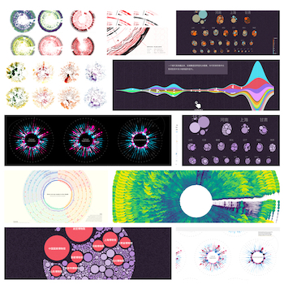

## 介绍
之前古柳在[「年更博主冒个泡，或将开启可视化之旅」](https://mp.weixin.qq.com/s/k54E0do8JP8w-8xOkbnbRg)一文里提到：
> 自己时不时会看看各种可视化作品，觉得不错的网站会随手放到浏览器书签里吃灰，也会在 `behance` 和 `pinterest` 上收藏好看的可视化图片。一直私心认为可视化的创作就像画画，虽然自己并不会画画，但大概都是需要多看看优秀作品，多开开眼，才能创作出真正内涵丰富，具有美感，令人惊艳的作品吧。

下图是 `pinterest` 上古柳自己收藏的一些图。  

出于方便自己和大家多看优秀作品，多开眼，并且真正实践时可以从中找灵感，在模仿的基础上进行创新的目的，因而古柳打算**定期将自己收藏的可视化相关的图或项目都整理出来进行分享**。

初步打算，这个系列可能**一周或半个月更新一篇**，主要由那段时间内有没有看到想分享的内容决定。并且会整理更新到：[GitHub - DesertsX/dataviz-collections](https://github.com/DesertsX/dataviz-collections)。  

由于**带有古柳个人偏好性和主观性**，所以不会收录可视化大类下的所有类别的作品，因而如果有对其它类别感兴趣的朋友看到这个系列，但是找不到自己中意的作品的话，需要注意下这里的说明。

在此借用[「聊聊数据可视化」](https://blog.zhida.now.sh/ued/2019/06/06/talking-data-viz.html)一文里对可视化的分类，我喜欢的和想分享的就是`「Data Driven Art/Design」`这类，以及`「Infographics」`下的`「互动故事讲述/ Interactive Storytelling」`。
> 从我个人不严谨的角度，可以把各种可视化根据信息量、传达信息的目的分成以下几个流派：
> - Generative Art: 生成艺术
> - Data Driven Art/Design: 数据参与的设计和艺术
> - Visual Data Analytics: 数据的可视化分析
> - Infographics: 数据信息图

重新拿[「年更博主冒个泡，或将开启可视化之旅」](https://mp.weixin.qq.com/s/k54E0do8JP8w-8xOkbnbRg)一文里举过的例子，就是下图荷兰的著名数据可视化创作者 `Nadieh Bremer` 对自己小时候接触到并很喜欢的`「百变小樱」`漫画进行可视化后的作品。项目链接：[Cardcaptor Sakura - Fifty chapters of adorable cuteness](http://www.datasketch.es/june/code/nadieh/)。  

另外由于时间精力有限，且这个系列的目的主要是整理与分享各种作品，所以初步打算不会具体介绍每个作品的详情，不过会附上链接和出处。类似阅读里的「泛读」，仅以多看为目的，具体大家对哪个作品感兴趣可自行进一步了解。

## 其它
此外，**针对某些优秀作品的翻新复现、代码实践**，会另外开一个系列进行更新，也会同步到：[GitHub - DesertsX/dataviz-in-action](https://github.com/DesertsX/dataviz-in-action)，考虑到难度更大，所以更新频率可能更久，争取一个月能啃掉一个项目。据古柳所知，还不曾有人做过这件事，可以期待一下！

另外，可视化相关英文文章的翻译、D3.js 基础教程文章等更多内容也是计划会更新的。除此之外，大家有什么关于更新的想法也可以评论或各种途径告诉我。

## 本系列目录汇总
**EP01**: [可视化作品分享：第1期 | 好评来袭](https://mp.weixin.qq.com/s/OYpXKscwcuesbvqWkdLiLw)  
  

**EP02**: [可视化作品分享：第2期 | 好评来袭](https://mp.weixin.qq.com/s/hSAMVG_xJw2hrtsrELWmhA)  
  

**EP03**: [可视化作品分享：第3期 | 好评来袭](https://mp.weixin.qq.com/s/-zXFU0ciwMOviAFDAqIKug)   
  

## 网络一线牵，珍惜这段缘
最后，欢迎关注古柳的公众号`「牛衣古柳」`，以便第一时间收到更新。  

更多交流，可添加古柳个人微信号`「xiaoaizhj」`，望备注来源；若想加入交流群可回复`「加群」`。  

